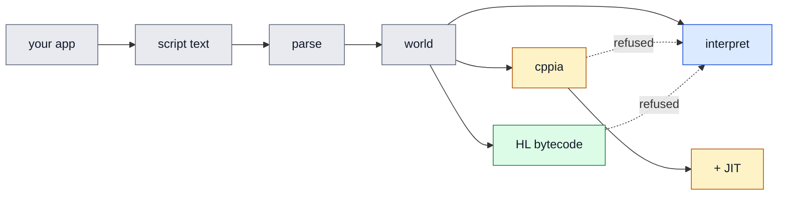

# hxScript

[](https://lib.haxe.org/p/hxscript)
[](https://lib.haxe.org/p/hxscript)
[](LICENSE)
[](https://github.com/MeguminBOT/hxscript/commits/main)
[](https://github.com/MeguminBOT/hxscript/stargazers)
[](https://haxe.org/)

**An advanced Haxe interpreter.** It parses Haxe-shaped source and evaluates it directly, with enough
of the language intact that a script can declare classes, enums, typedefs and abstracts, and extend
the ones your application already compiled. Declared types are enforced as values pass through them.

**On hxcpp and HashLink it also compiles**, at runtime, from source text, with no Haxe toolchain
anywhere in sight: a module becomes cppia or HashLink bytecode and loads into the running process as a
real class. That is what lets a script written after you shipped run at close to compiled speed.

> **On hxcpp this needs a patched hxcpp for now.** Stock hxcpp miscompiles parts of the cppia it
> loads, so a compiled script can disagree with the same script interpreted. The fixes are
> upstreamable and none of them is specific to this library, but until they land the compiled path
> wants
> [`MeguminBOT/hxcpp`, branch `patched-hxscript`](https://github.com/MeguminBOT/hxcpp/tree/patched-hxscript):
>
> ```sh
> haxelib git hxcpp https://github.com/MeguminBOT/hxcpp patched-hxscript
> ```
>
> [HXCPP-ISSUES.md](HXCPP-ISSUES.md) lists every fault behind that, and
> `python patches/apply-hxcpp.py` patches a checkout you already have instead. Interpreting is
> unaffected, and so is HashLink.

A script is an ordinary `.hx` file your program reads at runtime. `game.Entity` here is one of your
own compiled classes, marked `@:scriptable` in a package `-D hxscript_host=game` names:

```haxe
// mods/Bandit.hx
class Bandit extends game.Entity {
    var ambushes:Int = 0;

    public function new() super('bandit');

    override public function greet():String {
        ambushes++;
        return 'I ambush you, says $name';
    }
}
```

Three lines to load it, two to reach an instance, and what comes back is a real instance of your
class:

```haxe
var world = new Environment();
world.addModule(new Module(File.getContent('mods/Bandit.hx'), 'Bandit', []));
world.start();

var cls:ScriptedClass = cast world.resolve('Bandit');
var bandit:game.Entity = cls.typeCreateInstance([]);

bandit is game.Entity;   // true. Hand it to any native code taking an Entity
bandit.greet();          // your own call site, running the script's override
```

<details open>
<summary><b>One source text, four ways to run it</b></summary>



</details>

Interpreting is the default and works on every target. The dashed edges are the safety property the
whole thing rests on: whatever an emitter cannot express is reported with a reason and left to the
interpreter, so turning compiling on cannot break a script that was working.

## Contents

- [What it is for](#what-it-is-for)
- [Install](#install)
- [What scripts can do](#what-scripts-can-do)
- [Compiling at runtime](#compiling-at-runtime)
- [Errors say where and why](#errors-say-where-and-why)
- [Try it](#try-it)
- [Documentation](#documentation)
- [Status](#status), and [Targets](#targets)
- [Lineage](#lineage)

## What it is for

- **A scripting language for your application.** Ship a program that loads `.hx` files at runtime, so
  users can add content or behaviour without rebuilding, and without learning a second language.
- **Prototyping.** Iterate on logic without a compile cycle, in the language you are already writing,
  then move the parts that settled into compiled code unchanged.

## Install

```
haxelib install hxscript
```

Then `-lib hxscript` in your hxml, or `<haxelib name="hxscript" />` in a `Project.xml`. To track the
repository instead: `haxelib git hxscript https://github.com/MeguminBOT/hxscript`.

**That one line is the whole of the setup, including for the game library you already use.** With
lime, openfl, flixel, flixel-addons, flixel-ui or heaps in the build, hxScript force-compiles their
packages so scripts can name the types, generates a bridge per class scripts may `extend`, gives their
abstracts a runtime form so `BlendMode.ADD` means something, and registers emulations for the `inline`
members with no runtime form to call. `@:scriptable` plus `-D hxscript_host=<packages>` does the same
for your own classes, and a library it does not know is
[a record you write once](docs/advanced.md#4-adding-a-game-library).

The [embedding guide](docs/embedding.md) is the rest of it, and lists every flag, mark and setting.

## What scripts can do

It is a tree-walking interpreter, so what needs the *compiler* is gone and what needs only runtime
values is there.

| Works like Haxe | Parses, but weaker | Not available |
| --- | --- | --- |
| classes, `extends`, `override` | type parameters, erased to `Dynamic` | macros, `@:build`, reification |
| scripted and native interfaces | structural typedefs check values, not literals | compile-time type errors, inference |
| enums with parameters, `switch` extraction, guards | custom metadata, mostly inert | overload resolution |
| abstracts: `@:op`, `@:arrayAccess`, `from`/`to` | `private`, only where written explicitly | `@:structInit`, `@:multiType` |
| typedef aliases | `untyped`, a no-op | overriding a native `inline` or `final` method |
| statics, properties, getters and setters | `final` and `abstract` on a class, recorded but not enforced | interface default methods |
| `using`, `import`, string interpolation | | compile-time inlining, DCE |
| comprehensions, optional / default / rest args | | |
| typed multi-catch, closures, `#if` | | |
| runtime type enforcement, `Int`/`Float` correctness | | |

The last column is not a to-do list. A macro runs *in* the compiler and there is no compiler at
runtime; type parameters are erased by Haxe itself before the interpreter ever sees them; and an
`inline` method has no runtime representation to override.
[parity.md](docs/parity.md) is the long form, including where each boundary lives in the source.

**Typed by default**, which is the main thing separating this from the interpreters it descends from.
A script fails where Haxe would reject it, rather than several frames later somewhere unrelated.

```haxe
var x:Int = 5;        // ok
var y:Int = 3.5;      // throws: Float should be Int
var f:Float = 5;      // ok, widened
trace(cast(5, Int));  // a real checked cast
trace(5 is Int);      // true, primitives work as targets
```

`Config.typedMode = false`, or `-D hxscript_dynamic`, turns it off.

<details>
<summary><b>How it compares to hscript</b></summary>

[hscript](https://github.com/HaxeFoundation/hscript) is a small, fast expression interpreter. It
evaluates Haxe-shaped expressions and does that well; what it does not do is let a script declare
*types*, or bring the module-level language along with them.

| | hscript | hxScript |
| --- | --- | --- |
| expressions, functions, closures | yes | yes |
| **declaring classes in a script** | no | yes, including `extends` on your compiled classes |
| enums, typedefs, abstracts, module-level fields | no | yes, scripted or imported from compiled code |
| `import` / `using` | no | yes, incl. `as` aliases, `.*` wildcards, single fields |
| string interpolation (`'v$n'`) | no | yes |
| pattern matching | basic `switch` | extractors, guards, captures, struct and array patterns |
| property accessors (`var x(default, set)`) | no | yes |
| type annotations | parsed, ignored | **enforced at runtime** |
| `Int` / `Float` distinction | blurred by `Dynamic` | preserved (`/` is always `Float`) |
| errors | message | call stack across scripts and into the host |
| **compiling to native bytecode** | no | yes, at runtime, from source text, on hxcpp and HashLink |

The hscript column reflects `7d5eacc` on master, just past 2.7.0, which is what the benchmark suite
ran. hxScript carries the largest language surface here and pays for it per operation, while being
several times faster per *call*, because it signals `return` and `break` with flags where the others
throw exceptions. Which of those matters depends on what your scripts do more of, and
[benchmarks.md](docs/benchmarks.md) puts six libraries in this family through identical scripts.

</details>

## Compiling at runtime

Optional, and only where the target has bytecode of its own. On hxcpp a module can be translated to
[cppia](https://haxe.org/manual/target-cppia.html) and loaded as a real `Class<Dynamic>`, worth about
**26x per operation** and **46x per call**, rising to about **40x** and **104x** with hxcpp's JIT. On
HashLink a second backend emits HashLink bytecode into the running process, where the VM's own JIT
takes it.

```haxe
var report = hxscript.compile.Compiler.compile(env);
trace('${report.compiled.length} compiled, ${report.skipped.length} interpreted');
```

Needs `-D hxscript_cppia` and `-D scriptable` on hxcpp, or `-D hxscript_hl` on HashLink. It is decided
per module, so compiling the hot ones and interpreting the rest is a normal thing to do.

**Haxe can emit cppia too, but only as a build step**, and that is the difference this is for. Haxe's
path compiles a `.hx` file ahead of time, against a snapshot of your host's classes, on a machine with
the compiler installed, so it cannot compile a script that did not exist when you shipped. This
translates source text in-process, at load, with nothing installed, which is what makes it work for
mods, in-app editors and anything a user writes after the fact. Where both can compile the same
script, expect Haxe's output to be faster: it type-checks and optimises, and this is a direct
translation with no optimisation passes.

**It is the newest part of the library**, and what it rests on is a shared conformance corpus of 332
constructs run in six columns, one per way of executing a script. Every compiled column currently
agrees with its own target's interpreter on all 332 and refuses none of them;
[`support-table.md`](docs/support-table.md) is that reading, regenerated rather than written. Several
wrong-answer bugs were found this way, which is both the reason to trust it as far as you do and the
reason not to trust it further.

[modes.md](docs/modes.md) is the full comparison and when compiling repays what it costs;
[mode-benchmarks.md](docs/mode-benchmarks.md) is where the figures come from.

## Errors say where and why

A parse error quotes the line with a caret under the column. An unknown name says whether it is
missing from the build or only from the script's scope, and prints the `import` to add. A call that
resolved to nothing says whether the member is misspelled or `inline`. Everything carries a call stack
across script boundaries and into the host, rather than a bare message.

```
Playground.hx:42: character 17
  var x = foo(;
              ^
Unexpected token ';'
```

## Try it

Two worked examples and two applications, all runnable:

- [`examples/battle/`](examples/battle) is a small turn-based RPG whose creatures, bosses and status
  effects are all scripts. Its whole integration is one short file.
- [`examples/workbench/`](examples/workbench) is a coding environment where you write, test and run
  any number of scripts with no rebuild. The program it ships is a playable game written entirely in
  script.
- [`apps/sandbox/`](apps/sandbox) is the **hxScript Sandbox: Lime HXCPP**, a prototyping tool for
  lime, openfl and flixel where a project is a folder of `.hx` files it reads at runtime. Drop a
  folder in, press Run, edit, save, watch it reload.
- [`apps/sandbox-heaps/`](apps/sandbox-heaps) is the same idea on heaps and HashLink, and is where
  the 3D half is exercised: seven of the heaps samples as examples, a first-person shooter whose
  physics is tested without opening a window, and the conformance projects that check a real project's
  interop interpreted against compiled.

## Documentation

- **[Embedding guide](docs/embedding.md)** puts the library in a project, and lists every flag, mark
  and setting.
- **[Macros, a custom interpreter, and binding your API](docs/advanced.md)** covers generating
  bridges, making native abstracts visible, and subclassing `Interp`.
- **[Execution modes](docs/modes.md)** covers interpreting, compiling and jitting, and when each pays.
- **[How it works](docs/how-it-works.md)** is the long technical account, and opens with both
  pipelines as diagrams: how `-lib hxscript` reaches your game, and what happens to a script between
  source text and an answer.
- [Parity with Haxe](docs/parity.md) sets out what scripts can and cannot do, and why.
- [Internals](docs/internals.md) explains why the parts that are not obvious are the way they are.
- [Performance](docs/performance.md) covers what has been optimised, and how to measure without
  fooling yourself.
- [Benchmarks](docs/benchmarks.md) puts six libraries in this family through identical scripts;
  [mode benchmarks](docs/mode-benchmarks.md) runs one corpus interpreted, compiled and jitted; and
  [HashLink benchmarks](docs/hl-benchmarks.md) runs it against the same program compiled by Haxe,
  which is what a script costs against not scripting it at all.
- [Static checking](docs/checker.md) sets out the design for a pre-run checker, and its limits.
- [Tests](test) holds the suites, which double as executable documentation of behaviour.
- [Changelog](CHANGELOG.md) has what changed per release, including the renames 2.0.0 asks you
  to follow.

## Status

Working, and in use. What is known to be missing:

- [ ] **A script type cannot share a short name with a host type across modules.** Its own module
      resolves it correctly; another module in the same batch gets the host's, since the emitter
      keeps no per-module import table for other people's modules.
- [ ] **Static checking before a script runs.** Designed but not built: see
      [checker.md](docs/checker.md) for what it could prove without inference, what it could not, and
      why the boundary sits there.
- [ ] **Call-stack frames across interpreters.** A method declared in a module runs on that module's
      interpreter, and each interpreter owns its own stack with no link to its caller, so that frame
      does not appear in the calling script's trace. Errors themselves carry their frames wherever
      they are reported; this is the remaining half.

### Targets

Nine targets, no CI, so every box below was ticked by hand.

**Passes the suite, and runs a real application.**

- [x] **hxcpp** (`cpp`) — 350/350 interpreted, as cppia, and as cppia with the JIT. Ships
      [`apps/sandbox`](apps/sandbox): lime, openfl, flixel.
- [x] **HashLink** (`hl`) — 350/350 interpreted and as HashLink bytecode. Ships
      [`apps/sandbox-heaps`](apps/sandbox-heaps): heaps, as an HL/C binary.
- [x] **eval** — runs [`examples/battle`](examples/battle). One case, `an abstract Map through its
      alias`, kills the eval VM rather than answering it, so eval's `host` part reads 43/44. That is
      the VM, not this library.

**Runs the suite, with known failures.**

- [ ] **neko** — 4. Three are a scripted abstract forwarding to a native underlying type; the fourth
      is a host method reached through an interpreter's `parent` binding answering null.
- [ ] **python** — 2 failures and 3 gaps. Both failures are `@:forward` over the generated wrapper.

**Generates, but untested in a real application.**

- [ ] **js**
- [ ] **java**
- [ ] **lua**
- [ ] **php**

The bytecode compiler needs a target with bytecode of its own, so it is hxcpp and HashLink only, and
passes in full on both. Everywhere else a script is interpreted.

`sh test/all.sh` runs the whole matrix. Detail: [`test/known-failing.txt`](test/known-failing.txt) for
the failures, [`docs/support-table.md`](docs/support-table.md) for what every mode answers per
construct.

## Lineage

A fork of [inky03/hscript-insanity](https://github.com/inky03/hscript-insanity), itself an
experimental fork of [hscript](https://github.com/HaxeFoundation/hscript). hscript-insanity drew on
[hscript-iris](https://github.com/pisayesiwsi/hscript-iris) and
[RuleScript](https://github.com/Kriptel/RuleScript); both are worth a look, and both are in the
benchmark comparison.

What makes this a separate library rather than a fork with patches: types enforced at runtime with
`Int` and `Float` kept correct, abstracts that work either side of the boundary, structural typedefs
checked by field type, one diagnostic channel for every phase, automatic setup for the game library
already in your build, a compiler that translates a script to bytecode at runtime, and interpreter
performance work that was measured rather than assumed.

Pull requests welcome at [hxScript](https://github.com/MeguminBOT/hxscript/pulls).
