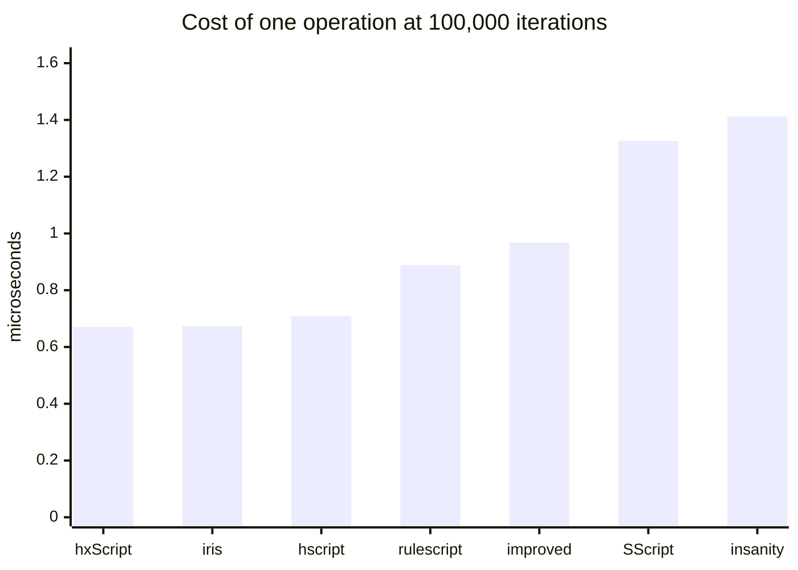
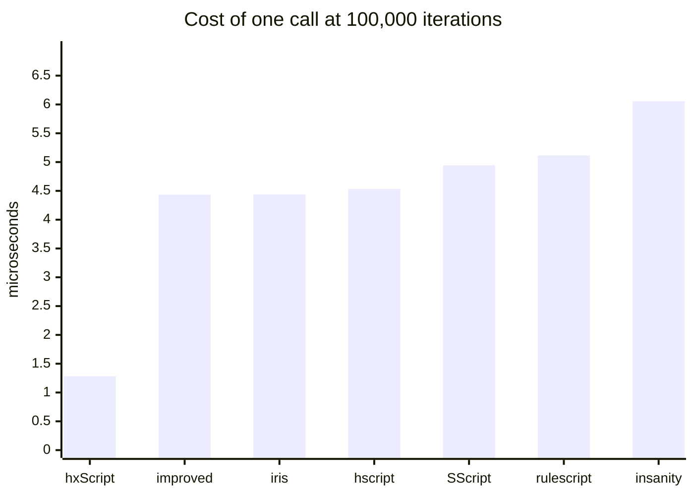
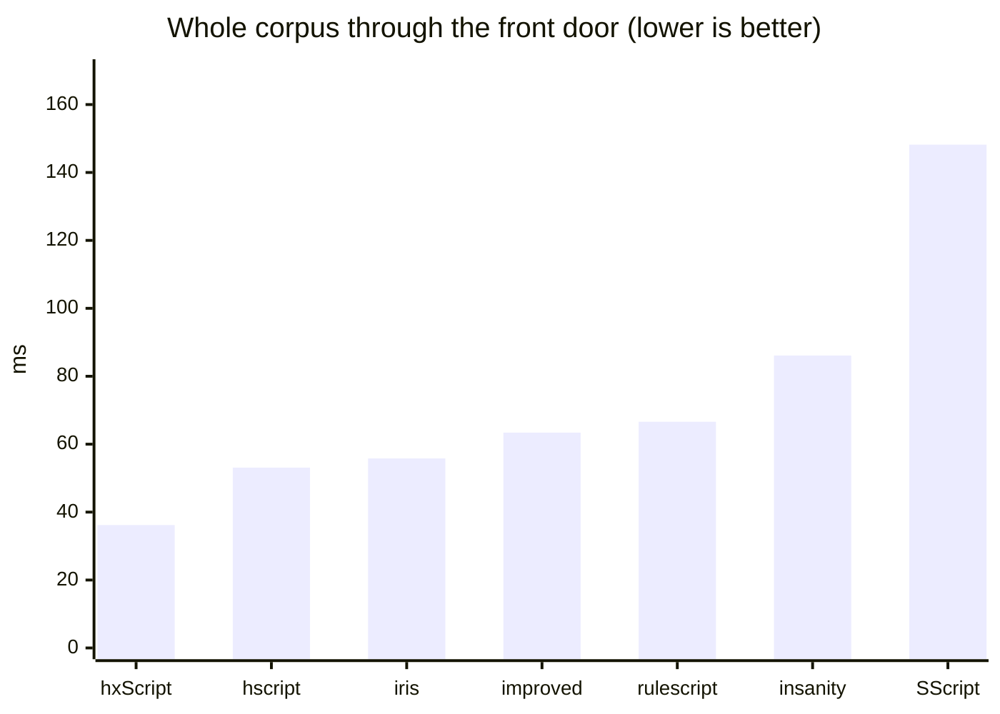

# Comparing Haxe scripting libraries

Seven hscript-family libraries running identical scripts.

## Read this first: different, not better

**No library here is "the best one."** Split the suite in two and the two halves say different
things: on the cost of one ordinary operation hxScript and hscript-iris are level at the front, a
third of a percent apart and well inside this machine's noise, while on the cost of one function
call hxScript is first by more than three times. Both are in the summary below, and neither is the
summary on its own.

The call gap has one cause, and it is not cleverness. Every other library unwinds `return`, `break`
and `continue` by **throwing an exception**, and a thrown exception costs microseconds on a static
target. hxScript signals them with flags. That is also why the corpus total flatters it: totals are
dominated by the call cases, so quote the per-operation and per-call averages instead.

`callCap20` is `call1` with twenty more variables in the enclosing scope and nothing else changed, so
the pair isolates a second design difference: whether building a call frame copies the captured
scope, and so costs something per captured variable. Five of the seven pay about half again for it.
hxScript and hscript-improved pay nothing.

The same applies to features. hscript is small and fast and has no scripted classes.
hscript-improved has them, and hxScript both instantiates one and calls its methods several times
faster, because its classes are generated bridges with real fields and theirs are a shell over a
map. RuleScript adds imports, usings and string interpolation. hscript-iris wraps a
fast interpreter in a friendlier host API. hxScript and hscript-insanity carry the largest language
surface (abstracts, modules, typedefs, properties, typed mode) and pay for it per operation.

Pick the one whose trade-off matches your workload. If you are choosing, run this suite with cases
that look like *your* scripts rather than trusting a total.

## What was measured

Every library is driven through its own public API, with the **same** script sources. Parsing is
untimed and separated from execution, so the numbers are interpreter speed rather than setup.

Every case ends in an expression whose value is known, and the harness checks it. A library that
parses and "runs" a case without doing the work is reported as `WRONG`, not as infinitely fast. That
check earned its place: it caught two mistakes in the expected values, and three genuine behavioural
differences between libraries that timings alone would have hidden.

### How a case is run

A case is a source string, an iteration count, and the value the source must evaluate to. The loop is
written **into the script**, not around it, so what is timed is the interpreter running a loop rather
than the host calling into it N times:

```haxe
// `call1`, at 100,000 iterations, expected value "7"
function f(a) return a;
var i = 0; var s = 0;
while (i < 100000) { s = f(7); i += 1; }
s;
```

Each library supplies two closures to
[`XBench.run`](../test/bench/xbench/XBench.hx) and nothing else, so the harness never touches a library's
internals:

- **`prepare(src)`** parses and builds whatever that library needs, and is **untimed**.
- **`exec(handle)`** runs the prepared program and returns its value, and is **timed**.

Per case the harness then:

1. calls `prepare` once; if it throws or returns null the case is `not supported` for that library and
   nothing is timed
2. runs 5 reps. Each rep calls `prepare` **again**, then times `exec` alone. Re-preparing every rep
   matters for fairness: a library that mutates its program in place or caches state on the
   interpreter would otherwise look faster on reps 2-5 than one that does not
3. takes the **median** of the 5 timings
4. compares the returned value against the expected one, and records `ok` or `wrong`

Expected values are derived from the iteration count (`call1` expects `7`, `loopPlain` expects the
count itself), so the same corpus and the same checking work at any scale.

The median rather than the fastest run: best-of-N answers "how fast can this go when nothing
interferes", which flatters whichever library got the quietest slice of the machine. The median
answers "what does this usually cost", which is what a host budgeting a frame needs, and an unlucky
scheduler spike moves it no more than a lucky one does.

Each case runs in its **own process**, with a 300-second timeout, because some libraries hang or
crash outright on some inputs and would otherwise take the rest of the run down with them. Each
emits one machine-readable line:

```
R|<lib>|<case>|<tier>|<iterations>|<status>|<median ms>|<value>
```

`tier` is `core` or `ext`, recording whether the case uses only constructs every library is expected to have.
It is not the `kind` column in the per-case table below, which `collate.py` derives from the case
name to decide which average the row feeds.

`collate.py` reads those lines and divides: microseconds per iteration is
`median ms x 1000 / iterations`. Nothing in the tables is a raw timing, which is why they stay
comparable across scales.

Parse throughput is measured separately, and is the only place `prepare` is timed: one 11.6KB source
of 80 small functions, median of 5, no execution.

### Built with `-dce no`, and that is a correctness setting

Under hxcpp's default `-dce std` the compiler eliminates `IntIterator.hasNext` and `next`: every call
site inlines them, so nothing references them statically. An interpreter reaching them by reflection
then finds a null field, and `for (i in 0...n)` fails, **in the host's build, not in the library**.
Earlier versions of this page reported that as a defect in four of the six libraries it then
covered. It was not.

Everything here is therefore built with `-dce no`, which measures the libraries rather than the build
settings. A probe over 83 commonly-scripted standard-library members found **42 unreachable** under
`-dce std` against 3 under `-dce no`; the catalogue is in
[`embedding.md`](embedding.md#dead-code-elimination), and it is worth reading before
concluding that any scripting library "cannot do" something.

### Every library is built with position tracking

hscript's `Expr` is `typedef ExprDef = Expr` unless it is built with `-D hscriptPos`: without that
define it records no source positions **at all**. hscript-improved, hscript-iris and RuleScript
inherit the same switch.

hxScript cannot turn positions off, because error reporting, `posInfos` and call-stack traces depend
on them. Comparing against a build that records nothing would not be measuring the same job, so every
library in the comparison is built **with** them. What the switch costs the libraries that have it is
reported separately at the end, where it reads as the price of a feature rather than a ranking.

### One scale

The corpus runs at 100,000 iterations. Three scales spanning 20x were used to establish that the
ranking is a property of the interpreters rather than a warm-up or fixed-setup artefact; it held,
moving by at most a few percent, so re-establishing it on every run is not worth three times the wall
time. `SCALES="25000 100000 500000"` checks it again after a change that could plausibly disturb it.

## Results

<!-- BEGIN GENERATED: test/bench/xbench/collate.py -->

### Every case, microseconds per iteration at 100,000

**Lower is faster.** Every number on this page is a cost, in microseconds or milliseconds,
so a smaller one is better. Two places invert that and say so where they appear: the
`relative` row, where a bigger multiple means slower, and the frame-budget table, where a
bigger count means more script fits.

One row per case, and the only per-case table in this document. `kind` is which average the
row feeds: `op` and `call` are averaged separately because they differ by design rather than
by degree. `unwind` cases are in neither, being dominated by how a library implements
`continue` and `throw`, and nor are `compound` ones, which do far more than one operation per
iteration and would describe themselves rather than the interpreter.

<details>
<summary><strong>43 cases, click to expand</strong></summary>

| case | kind | **hxScript** | insanity | SScript | hscript | improved | iris | rulescript |
| --- | --- | --- | --- | --- | --- | --- | --- | --- |
| `noCall` | op | 0.435 | 0.966 | 0.495 | 0.418 | 0.613 | 0.400 | 0.533 |
| `loopPlain` | op | 0.486 | 1.102 | 0.500 | 0.451 | 0.614 | 0.424 | 0.568 |
| `loopCont` | unwind | 0.632 | 3.565 | 2.771 | 2.556 | 2.828 | 2.492 | 3.242 |
| `postIncr` | op | 0.435 | 0.974 | 0.433 | 0.387 | 0.507 | 0.371 | 0.477 |
| `arith` | op | 0.585 | 1.316 | 0.659 | 0.550 | 0.752 | 0.507 | 0.711 |
| `locals` | op | 0.532 | 1.245 | 0.606 | 0.503 | 0.749 | 0.492 | 0.641 |
| `blocks` | op | 0.622 | 1.250 | 0.697 | 0.579 | 0.949 | 0.547 | 0.755 |
| `field` | op | 0.568 | 1.110 | 0.558 | 0.464 | 0.726 | 0.444 | 0.616 |
| `fieldSet` | op | 0.599 | 1.092 | 0.518 | 0.454 | 0.744 | 0.450 | 0.588 |
| `method` | op | 1.048 | 1.538 | 0.843 | 0.739 | 1.081 | 0.700 | 0.936 |
| `index` | op | 0.494 | 1.057 | 2.875 | 0.487 | 0.698 | 0.469 | 0.615 |
| `indexSet` | op | 0.505 | 1.039 | 8.116 | 0.489 | 0.709 | 0.488 | 0.599 |
| `not` | op | 0.505 | 1.076 | 0.593 | 0.512 | 0.733 | 0.474 | 0.663 |
| `neg` | op | 0.484 | 1.045 | 0.545 | 0.455 | 0.674 | 0.438 | 0.585 |
| `call0` | call | 0.817 | 4.696 | 3.975 | 3.688 | 4.054 | 3.608 | 4.243 |
| `call1` | call | 1.253 | 5.232 | 4.337 | 3.963 | 4.395 | 3.908 | 4.532 |
| `call3` | call | 1.818 | 6.270 | 4.820 | 4.325 | 4.885 | 4.238 | 4.981 |
| `callCap20` | call | 1.239 | 8.017 | 6.638 | 6.160 | 4.403 | 6.002 | 6.705 |
| `forRange` | op | 0.170 | 0.305 | 0.217 | 0.176 | 0.244 | 0.157 | 0.225 |
| `forArray` | op | 0.188 | 0.312 | 0.259 | 0.204 | 0.277 | 0.176 | 0.251 |
| `arrayDecl` | op | 0.992 | 1.566 | 0.860 | 0.753 | 1.205 | 0.668 | 0.956 |
| `strConcat` | op | 0.774 | 1.708 | 1.056 | 0.941 | 1.173 | 0.926 | 1.103 |
| `ternary` | op | 0.645 | 1.426 | 0.754 | 0.624 | 0.859 | 0.582 | 0.800 |
| `anonField` | op | 0.835 | 1.470 | 0.742 | 0.631 | 1.014 | 0.627 | 0.861 |
| `closureCall` | op | 1.201 | 5.678 | 4.840 | 4.422 | 4.968 | 4.310 | 5.335 |
| `hostMethod` | op | 0.982 | 1.505 | 0.807 | 0.682 | 1.061 | 0.670 | 0.909 |
| `hostStatic` | op | 1.356 | 1.771 | 1.012 | not supported | not supported | 0.819 | 1.065 |
| `arrayPush` | op | 0.974 | 1.421 | 3.137 | 0.663 | 0.995 | 0.646 | 0.827 |
| `boolLogic` | op | 0.697 | 1.761 | 0.836 | 0.723 | 0.982 | 0.685 | 0.892 |
| `modArith` | op | 0.657 | 1.512 | 0.756 | 0.659 | 0.889 | 0.591 | 0.835 |
| `switch` | op | 0.792 | 1.455 | 0.806 | 0.619 | 0.847 | 0.563 | 0.793 |
| `tryCatch` | unwind | 3.518 | 4.881 | 4.408 | 4.171 | 4.558 | 3.874 | 5.037 |
| `strInterp` | op | 0.967 | 1.608 | 3.928 | WRONG (v$n) | WRONG (v$n) | 0.701 | 0.825 |
| `mapLiteral` | op | 1.344 | 2.019 | 3.277 | 1.193 | 1.514 | 1.047 | 1.409 |
| `arrayCompr` | compound | 2.893 | 4.470 | 4.007 | 3.521 | 5.217 | 6.204 | 7.085 |
| `varTyped` | op | 0.448 | 0.954 | 0.499 | 0.420 | 0.618 | 0.399 | not supported |
| `fnTyped` | call | 1.671 | 5.403 | 4.345 | 3.986 | 4.389 | 3.899 | not supported |
| `classNew` | compound | 2.798 | 66.374 | not supported | not supported | 4.857 | not supported | not supported |
| `classCall` | call | 1.555 | 5.387 | not supported | not supported | 4.586 | not supported | not supported |
| `classField` | op | 0.665 | 1.249 | not supported | not supported | 0.831 | not supported | not supported |
| `stringSwitch` | op | 0.769 | 1.381 | 0.790 | 0.608 | 0.849 | 0.543 | 0.808 |
| `nullCoal` | op | 0.463 | 1.206 | 0.541 | 0.472 | 0.684 | 0.454 | 0.594 |
| `abstractOp` | op | 5.430 | 10.179 | not supported | not supported | not supported | not supported | not supported |

</details>

### Summary, over the 35 cases every library ran

| | **hxScript** | insanity | SScript | hscript | improved | iris | rulescript |
| --- | --- | --- | --- | --- | --- | --- | --- |
| us per operation (28 cases), lower is faster | 0.671 | 1.412 | 1.326 | 0.709 | 0.968 | 0.673 | 0.889 |
| us per call (4 cases), lower is faster | 1.282 | 6.054 | 4.943 | 4.534 | 4.434 | 4.439 | 5.115 |
| parse, ms, lower is faster | 0.833 | 1.019 | 2.464 | 1.115 | 3.244 | 0.77 | 1.223 |
| corpus total, ms, lower is faster | 3095 | 7667 | 6807 | 4824 | 5745 | 4917 | 6071 |
| total relative to hxScript, higher is slower | 1.00x | 2.48x | 2.20x | 1.56x | 1.86x | 1.59x | 1.96x |





### How much script fits in one frame

The per-operation and per-call averages read as a budget. A 60Hz frame is 16.667ms;
the second pair is a 2ms slice of it, which is a more realistic allowance once
rendering and physics are paid for. Whole units, rounded down.

**Higher is better here**, unlike everywhere else on this page: these are how much
script fits, not what it costs.

**Derived, not measured at this scale.** Timing a frame's worth of work directly is dominated
by noise, because a few hundred operations is far too short an interval to time on a preemptive OS.
These come from the 100,000-iteration averages above, which are stable, multiplied back out.
Read it the other way for a budget you already have in mind:

```
per-call us  x  calls per frame  x  60  =  us per second spent in script
```

| | **hxScript** | insanity | SScript | hscript | improved | iris | rulescript |
| --- | --- | --- | --- | --- | --- | --- | --- |
| operations per 60Hz frame | 24,847 | 11,803 | 12,573 | 23,498 | 17,213 | 24,759 | 18,752 |
| calls per 60Hz frame | 13,003 | 2,753 | 3,372 | 3,675 | 3,758 | 3,754 | 3,258 |
| operations per 2ms slice | 2,981 | 1,416 | 1,508 | 2,819 | 2,065 | 2,971 | 2,250 |
| calls per 2ms slice | 1,560 | 330 | 404 | 441 | 451 | 450 | 390 |

### What position tracking costs the libraries that can switch it off

Not a ranking. hxScript cannot turn positions off, so the comparison above is built
with them on everywhere; this is what that decision costs the others. At 100,000.

| | hscript | improved | iris | rulescript |
| --- | --- | --- | --- | --- |
| us per operation, with | 0.709 | 0.968 | 0.673 | 0.889 |
| us per operation, without | 0.620 | 0.859 | 0.658 | 0.734 |
| cost | 14.4% | 12.8% | 2.3% | 21.2% |
| parse with, ms | 1.115 | 3.244 | 0.77 | 1.223 |
| parse without, ms | 0.575 | 2.521 | 0.549 | 0.587 |

### The same corpus through each library's own front door, at 1,000

Every table above hoists parsing out of the timing so the interpreters can be compared.
This one hoists nothing: each library is driven through its own one-call entry point, so
construction, parsing and any work it repeats internally are all inside the number.

Totals over the 35 cases every library completed this way, at a much lower scale than
the tables above, because a call that reparses every time is not one a host makes a
hundred thousand times.

| | **hxScript** | insanity | SScript | hscript | improved | iris | rulescript |
| --- | --- | --- | --- | --- | --- | --- | --- |
| corpus through the front door, ms, lower is faster | 36.2 | 86.1 | 148.2 | 53.1 | 63.4 | 55.8 | 66.6 |
| relative to hxScript, higher is slower | 1.00x | 2.38x | 4.09x | 1.46x | 1.75x | 1.54x | 1.84x |
| parse alone, ms, from the table above | 0.833 | 1.019 | 2.464 | 1.115 | 3.244 | 0.77 | 1.223 |



Left out of the totals, since not every library completed them this way: `hostStatic`, `strInterp`, `varTyped`, `fnTyped`, `classNew`, `classCall`, `classField`, `abstractOp`.

<!-- END GENERATED -->

## Behavioural differences found

These came out of the value checking, not the timing, and matter more than any of the numbers above
if you are choosing a library. All were reproduced directly, outside the harness.

**`for (i in 0...n)` works everywhere, and a previous version of this page said otherwise.** It was
recorded as broken on hxcpp in hscript, hscript-improved, RuleScript and hscript-insanity, blamed on
`IntIterator.hasNext`/`next` being `inline` and having no runtime form. Both halves were wrong. They
have a runtime form; `-dce std` removes it because every call site inlines them, so nothing references
them. Build with `-dce no` and all seven libraries run `forRange` and `arrayCompr` correctly. The whole
`CRASH` column this page used to carry is gone, and so are the nine timeouts behind it.

Worth stating plainly because the failure looks exactly like a library defect from the outside: a
script gets `Cannot call null`, or on a build without position tracking it silently abandons the rest
of the program. Neither points at the host's own compiler flags, which is where the cause is. See
[`embedding.md`](embedding.md#dead-code-elimination) for what else DCE takes with it.

**`++` works in all seven**, and every loop counter in this suite still uses `i += 1`, which is equally
fair to all of them and does not depend on which version of a library is checked out. `postIncr`
isolates the construct.

**RuleScript does not build against current hscript.** It needs an hscript predating
`Interp.makeKeyValueIterator` and `resolveType`; it was pinned to hscript `609c489` here. Its
`extraParams.hxml` also has to be passed by hand when using `-cp` instead of haxelib, since it patches
hscript's enums at compile time.

**Single-quote string interpolation** (`'v$n'`) is absent in hscript and hscript-improved, which
return the literal text. hxScript, hscript-insanity, hscript-iris and RuleScript interpolate.

## What was tested

Haxe 4.3.7, hxcpp, `-dce no`, Windows, single machine, one sitting, 24-thread build.

| library | version | notes |
| --- | --- | --- |
| hxScript | working tree | always tracks positions |
| [hscript-insanity](https://github.com/inky03/hscript-insanity) ("insanity") | `ad67b16` (**pinned**) | always tracks positions |
| [SScript](https://github.com/ThomasDarkson/SScript) | `9102af3` (main, 22.4.1) | always tracks positions |
| [hscript](https://github.com/HaxeFoundation/hscript) | `7d5eacc` (master, post-2.7.0) | built both ways |
| [hscript-improved](https://github.com/CodenameCrew/hscript-improved) | `48ec0f4` (master) | built both ways |
| [hscript-iris](https://github.com/pisayesiwsi/hscript-iris) | `62d828b` (**dev**) | built both ways |
| [RuleScript](https://github.com/Kriptel/RuleScript) | `b5b377a` (master) | built both ways; needs hscript `609c489` |

Every library is at its default branch's tip, except hscript-iris, measured on `dev`.

**SScript is measured through its parser and interpreter directly.** It is a class-oriented fork,
and two things about measuring it are worth stating rather than leaving in the runner. Its
`execute()` reparses the source on every call, so using it would have put parse cost inside the
timed section where every other library has only execution there; its `parser` and `interp` are
both public, so the runner parses once and runs the tree, which is what the RuleScript runner does
for the same reason. And its `Expr` carries `pmin`, `pmax` and `line` unconditionally, so like
hxScript and insanity it is built once rather than both ways.

**No library moved this run.** Every one of them is at the commit the table above names, and the
corpus is unchanged, so this table and the previous one can be read against each other. That makes
the whole row of them a control, and the answer is that nothing here moved beyond noise:

| lower is faster | previous | this run | change |
| --- | --- | --- | --- |
| hscript, us per operation | 0.704 | 0.709 | +1% |
| hscript-improved | 0.977 | 0.968 | -1% |
| hscript-iris | 0.711 | 0.673 | -5% |
| RuleScript | 0.917 | 0.889 | -3% |
| SScript | 1.328 | 1.326 | 0% |
| insanity | 1.402 | 1.412 | +1% |
| **hxScript** | **0.662** | **0.671** | **+1%** |

Seven libraries at the same commits as before, four of them within a percent and none further out
than the 5% hscript-iris moved. That is drift in the machine rather than in any of the code, and it
is why the caveats below say to read the ratios and not the microseconds. hxScript is in the same
band as the rest despite having a changed working tree: nothing in this release was aimed at the
interpreter's hot path. The rule still stands: read a column against the others in ITS OWN table,
never against a number from an earlier run.

**insanity is pinned rather than current, and that is deliberate.** Its `main` is 46 commits further
on and runs the ordinary cases about 11% faster, but a script that declares a class no longer runs
there at all: `classNew`, `classCall` and `classField` fail with `Null Function Pointer` out of the
library, reproduced outside the harness on a three-line script. `Script` is meant to take a class
declaration, since `Interp.startDecl` handles `DClass` and the scripted class's `module` parameter
is optional, so this reads as a regression rather than a change of API. Measuring the tip would have
published three `not supported` cells for something the library supports and intends to, so this
table stays on the last commit where the whole corpus runs. It moves once the fix lands.

**hscript-improved is built with its own macros now, and was not before.** `-cp` does not read a
library's `extraParams.hxml`, and hscript-improved's carries `UsingHandler.init()` and
`ClassExtendMacro.init()`. It builds without them, which is why this went unnoticed: what was
measured was the library minus two of its features. Both are passed now, in
`improved-params.hxml`, the same way RuleScript's have always been. It cost that column 1%, so the
correction is to what was being described rather than to any number.

**RuleScript's figures are new rather than changed.** Its build had been failing, and the runner was
silently falling back to binaries left behind by an earlier run: they answered the cases the corpus
held when they were built and reported everything added since as `crash`. Both halves are fixed.
The build parameters named `hscript.Ast`, a module neither hscript checkout declares, where
RuleScript's own `extraParams.hxml` names `hscript.Tools`; and `run.sh` now removes a binary before
rebuilding it, so a failed build can no longer leave a usable one behind.

### The machine

| part | |
| --- | --- |
| CPU | AMD Ryzen 9 3900X, 12 cores / 24 threads |
| RAM | 32GB DDR4-3200 CL14 |
| storage | WD Black SN7100 2TB NVMe |

Every figure is single-threaded: the thread count built the binaries, it did not run the corpus.

## Reproducing

The harness is in [`../test/bench/xbench`](../test/bench/xbench). In short:

```sh
LIBS=/path/to/library/checkouts sh test/bench/xbench/run.sh
```

`LIBS` wants checkouts named `insanity`, `hscript`, `improved`, `iris`, `rulescript`, `sscript` and
`hscript-rs` (the older hscript RuleScript needs). Anything missing is skipped, and the collator
drops absent libraries rather than emptying the shared-case set, so a subset produces a table for
that subset.

Two things about those checkouts are easy to get wrong and neither announces itself:

- **`iris` is measured on `dev`, not on its default branch.** `master` carries a commit that removes
  string interpolation and breaks `postIncr`, so checking out the default branch quietly changes
  what is being compared and reports the difference as though the library had regressed.
- **A library's own `extraParams.hxml` is not read by `-cp`, only by `-lib`.** Three libraries need
  theirs replayed, and `run.sh` does it two ways. insanity gets the checkout's own file passed
  straight through, because it moved its macro from `insanity.backend.macro` to `insanity.macro`
  between two commits measured here and a copy would have gone on naming the old path, setting
  nothing up while appearing to work. hscript-improved and RuleScript get hand-written copies,
  [`improved-params.hxml`](../test/bench/xbench/improved-params.hxml) and
  [`rulescript-params.hxml`](../test/bench/xbench/rulescript-params.hxml), the latter because its
  own file opens with `-lib hscript` and would pull an hscript it cannot build against. Without any
  of this, insanity does not build and hscript-improved builds without two of its features, which
  is worse, because it looks like it worked.

Scales default to `100000` and are settable. Passing more than one also brings back the
scale-stability table:

```sh
SCALES="25000 100000 500000" LIBS=... sh test/bench/xbench/run.sh
```

They must be multiples of 1000, which is the array length `forArray` walks.

The front-door pass runs at `FRONT`, which defaults to `1000` and is separate from `SCALES` because
it measures a different thing. Each library is driven there through its own one-call entry point,
so nothing in that table shares code with the runners the other tables use.

`DCE` defaults to `no` and should stay there; see above. `DCE=std` reproduces what a host with default
compiler flags actually gets, which is a different and also useful question.

`collate.py` writes the whole of the Results section above. Paste its output between the two
`GENERATED` markers rather than editing the tables by hand: it is one table of record plus its
summaries, so a re-run replaces all of it in one go and there is nothing to keep in sync.

Every hscript-derived library is built twice, once with
[`hscript-pos.hxml`](../test/bench/xbench/hscript-pos.hxml) and once without. Do not drop the
position-tracking builds when comparing against hxScript: without that define those libraries record
no source positions at all, and hxScript cannot work that way.

## Caveats

**Read the ratios, not the numbers.** Absolute microseconds drift with machine state by well over
10%, which is more than most of the differences between neighbouring libraries here. Rebuild and
re-run everything in one sitting before comparing anything, and never merge a re-run of one library
into a table measured in another sitting.

**The noise floor of this suite is about 5%.** Running the whole thing twice on the same machine,
median of 5 at 100,000 iterations, moved the per-operation averages by at most 2.4% and the per-call
averages by at most 5.0% (hscript-iris; every other library stayed inside 2.4%). Rankings and ratios
did not change. So treat a gap under roughly 5% as unresolved by this suite rather than as a
difference, and re-run before believing one.

**The shared-case set excludes the cases some library cannot run**, so the totals and averages
describe a common subset and say nothing about the features that subset leaves out: `postIncr` (iris
has no `++`), `strInterp` (three libraries return the literal text), `varTyped` and `fnTyped`
(RuleScript rejects type annotations), and `classNew`/`classCall`/`classField` (only some libraries
have scripted classes). Excluding them is generous to the libraries that fail them. The per-case list
is where those live.

**`arrayCompr` and `classNew` are excluded from the averages too**, for a different reason: they do
far more than one operation per iteration, so a mean including them describes the outlier. Leaving
`arrayCompr` in moved hscript-iris's per-operation figure from 0.53us to 1.02us on this run, which
would have reported it as twice as slow as it is.

**A micro-benchmark is not an application.** These cases isolate single operations on purpose, so
they overstate interpreter differences relative to a real script that also touches the host's own
code. Use them to understand *where* libraries differ, then measure your own workload.
