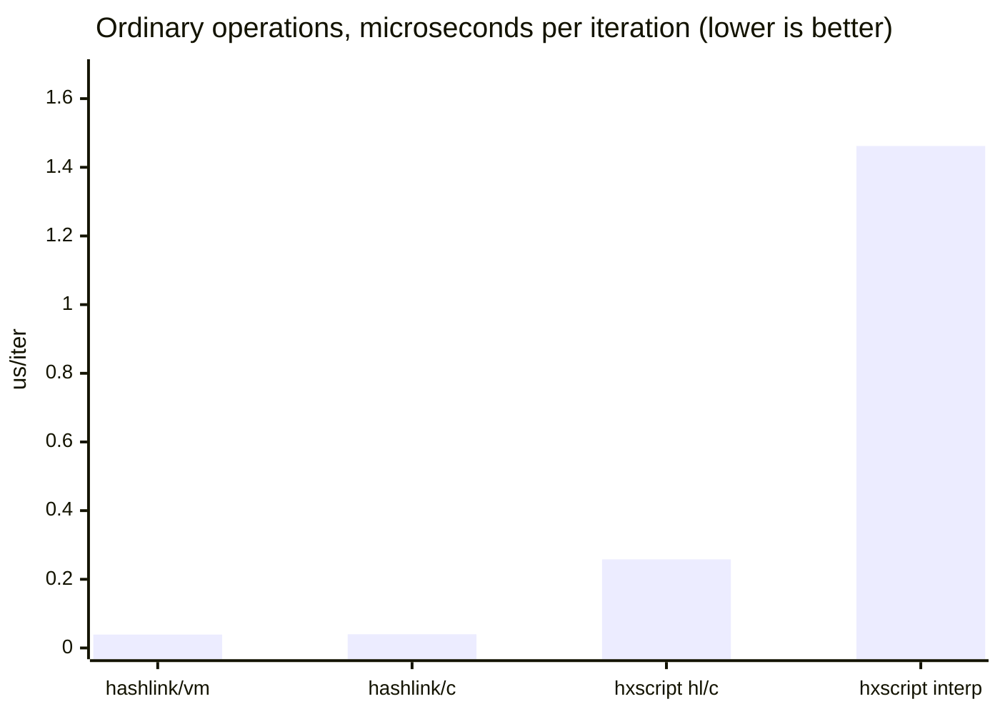
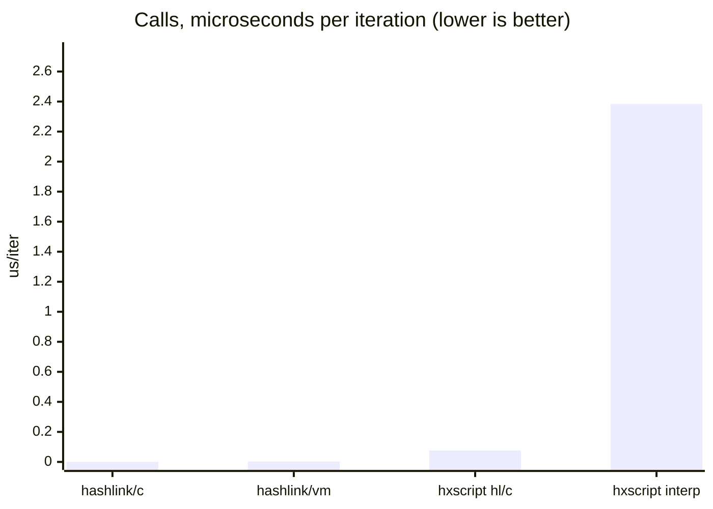

# Benchmarking a script against the program it would otherwise have been

What a script costs on HashLink, measured against the same corpus written as Haxe and compiled by
Haxe. This page is the method and the evidence.

The other two benchmark documents compare things of one kind. [`benchmarks.md`](benchmarks.md) puts
six hscript-family interpreters beside each other, and [`mode-benchmarks.md`](mode-benchmarks.md)
puts this library's three hxcpp modes beside each other. Both answer "which of these is faster".
Neither answers the question a host asks before moving logic into a script at all, which is what it
costs against not scripting it: everything in those two documents is already a script.

That is the question here, in four columns:

| column | what it is |
| --- | --- |
| `hashlink/c` | the corpus written as Haxe, compiled to C, linked as a native binary |
| `hashlink/vm` | the same Haxe, compiled to `.hl`, run by the HashLink VM |
| `hxscript hl/c` | the corpus as scripts, compiled to HashLink bytecode at run time |
| `hxscript interp` | the same scripts, walked as a tree |

Same rules as the other two suites, deliberately, because the three are read together. Do not compare
their numbers across documents: same rules and same scale, but different machines, different targets
and, between this and the cross-library suite, a different corpus.

## Contents

- [What was measured](#what-was-measured): [the corpus exists once](#the-corpus-exists-once),
  [how a case is run](#how-a-case-is-run), [what the optimiser does](#what-the-optimiser-does-to-it),
  [scale](#one-scale)
- [Results](#results)
- [What the value checking caught](#what-the-value-checking-caught)
- [Reproducing](#reproducing)
- [Caveats](#caveats)

## What was measured

### The corpus exists once

The comparison needs the same program twice: as source text for the interpreter and the emitter, and
as real declarations for `haxe` to compile. Written twice by hand, the two drift, and then the suite
is measuring the difference between two corpora rather than between two ways of running one.

So it is written once, in [`ModeCases.hx`](../test/bench/mbench/ModeCases.hx), the same corpus the
execution-mode benchmark uses, and [`GenNative.hx`](../test/bench/hlbench/GenNative.hx) writes the
Haxe half out of it before every run. The transform is three substitutions: the case's class is given
a name of its own, its helper class is given one, and the loop bound is redirected through a value
the optimiser cannot see.

One case is not generated. `noCall` is a single assignment per iteration and nothing else, which
written out is `s = s`, and Haxe rejects that outright as assigning a value to itself. It reports
`unsupported` in the native columns with that reason rather than being quietly rewritten into
something else, since a rewritten case is no longer the case the other suites run.

### How a case is run

Same rules as the other two suites. Preparing is untimed and running is timed; every repetition
re-prepares, so a mode that warms a cache on its first run is measured on the same footing as one
that does not; the figure is the median of five rather than the best, because best-of-N reports how
fast a thing goes when nothing interferes and a host budgeting a frame is asking what it usually
costs. Every case ends in a value the harness checks.

One process per case, as in the other suites.

Three of the four columns come out of **one binary**, so the compiled Haxe and the scripts are
measured in the same process, by the same clock, against the same allocator. Only the VM column is a
second build, since running on the VM is the thing it measures, and that build carries no library at
all: the harness guards its scripted half behind `#if hxscript_hl`, so nobody has to wonder whether
linking the compiler in changed the number.

### What the optimiser does to it

Haxe compiles the native columns for real, and a real compiler handed a synthetic loop whose result
it can prove emits no loop at all. The bound is read through a mutable static so it cannot fold on
the iteration count alone, but a body it can hoist still goes: a call that always answers the same
thing, an assignment nothing reads. Those rows are marked `folded`.

**They are counted anyway, and that is the point rather than a caveat.** What a host is deciding is
whether to put some logic in a script or leave it as Haxe, and if it is left as Haxe then the
optimiser is part of what it gets. Excluding those cases would answer a question nobody asked, and
building the native columns with `--no-inline` to keep them would make the thing this library is
compared against slower than the code a host actually ships, which flatters the scripted columns for
free. `vs ~0` in the summary is the honest limit of the same comparison: the native side did not run,
and the scripted side ran every iteration.

### One scale

100,000 iterations per case. A natively compiled case has its bound written into it, so unlike the
other suites this one cannot sweep scales without rebuilding: `run.sh` regenerates both halves
together and the harness refuses to run at any scale but the one it was built for, because two
columns measured at two scales is not a comparison.

## Results

<!-- BEGIN GENERATED: test/bench/hlbench/collate.py -->

### What a script costs against the same program compiled

Averaged over the 28 `op` cases and the 6 `call` cases every column ran correctly, at
100,000 iterations each. `x` is against `hashlink/c`, the native binary, which is the floor:
what the language costs once Haxe has seen the code.

| column | op, us/iter | x | call, us/iter | x | getting ready |
| --- | --- | --- | --- | --- | --- |
| `hashlink/c` | 0.0402 | 1.0x | 0.0000 | 1.0x | 0 ms |
| `hashlink/vm` | 0.0386 | 1.0x | 0.0026 | vs ~0 | 0 ms |
| `hxscript hl/c` | 0.2581 | 6.4x | 0.0759 | vs ~0 | 7.072 ms |
| `hxscript interp` | 1.4624 | 36.4x | 2.3837 | vs ~0 | 2.857 ms |





27 of those cases are marked `folded` below, meaning Haxe proved the answer and emitted no
loop at all: `arith`, `arrayDecl`, `blocks`, `boolLogic`, `call0`, `call1`, `call3`, `callCap20`, `classCall`, `closureCall`, `field`, `fieldSet`, `forArray`, `forRange`, `index`, `indexSet`, `locals`, `loopCont`, `loopPlain`, `method`, `modArith`, `neg`, `not`, `nullCoal`, `postIncr`, `switch`, `ternary`.

They are counted anyway, and that is the point rather than a caveat. What a host is
deciding is whether to put this logic in a script or leave it as Haxe, and if it is left as
Haxe the optimiser is part of what it gets. `vs ~0` in the table above is that answer taken
to its limit: the native side did not run at all, and the scripted side ran every iteration.

### Every case, microseconds per iteration at 100,000

`kind` is which average the row feeds. `op` and `call` are averaged separately because they
differ by design rather than by degree; `unwind` and `compound` rows are in neither, being
dominated by how a mode implements `continue` and `throw`, or by doing far more than one
thing per iteration.

`refused` in a **native** column means the case cannot be written as Haxe at all, so there
was nothing to compile and nothing ran: `noCall`. Those are a property of the corpus, not of a compiler.

<details>
<summary><strong>39 cases, click to expand</strong></summary>

| case | kind | `hashlink/c` | `hashlink/vm` | `hxscript hl/c` | `hxscript interp` |
| --- | --- | --- | --- | --- | --- |
| `noCall` | op | refused | refused | 0.0022 | 0.6071 |
| `loopPlain` | op | 0.0000 (folded) | 0.0016 | 0.0022 | 0.5207 |
| `postIncr` | op | 0.0000 (folded) | 0.0016 | 0.0018 | 0.4735 |
| `arith` | op | 0.0000 (folded) | 0.0020 | 0.0027 | 0.8843 |
| `locals` | op | 0.0000 (folded) | 0.0018 | 0.0024 | 1.3595 |
| `blocks` | op | 0.0000 (folded) | 0.0018 | 0.0022 | 1.0134 |
| `not` | op | 0.0000 (folded) | 0.0023 | 0.0022 | 0.6557 |
| `neg` | op | 0.0000 (folded) | 0.0023 | 0.0025 | 0.6984 |
| `index` | op | 0.0000 (folded) | 0.0009 | 0.2574 | 0.9139 |
| `indexSet` | op | 0.0000 (folded) | 0.0009 | 0.2038 | 0.7009 |
| `field` | op | 0.0000 (folded) | 0.0023 | 0.0024 | 2.5516 |
| `fieldSet` | op | 0.0000 (folded) | 0.0020 | 0.0023 | 1.7758 |
| `method` | op | 0.0000 (folded) | 0.0027 | 0.0036 | 3.5353 |
| `ternary` | op | 0.0000 (folded) | 0.0048 | 0.0048 | 0.9650 |
| `switch` | op | 0.0000 (folded) | 0.0048 | 0.2212 | 1.6463 |
| `strConcat` | op | 0.2947 | 0.2756 | 0.6362 | 1.6083 |
| `strInterp` | op | 0.2942 | 0.2719 | 1.1951 | 2.2784 |
| `arrayDecl` | op | 0.0000 (folded) | 0.0019 | 0.5865 | 2.7342 |
| `mapLiteral` | op | 0.4125 | 0.3413 | 0.7253 | 3.5477 |
| `forRange` | op | 0.0000 (folded) | 0.0007 | 0.0007 | 0.3995 |
| `forArray` | op | 0.0001 (folded) | 0.0020 | 1.3361 | 0.3145 |
| `anonField` | op | 0.0761 | 0.0726 | 0.7229 | 1.5319 |
| `hostMethod` | op | 0.0326 | 0.0507 | 0.1408 | 1.6501 |
| `hostStatic` | op | 0.0012 | 0.0100 | 0.8075 | 3.3903 |
| `arrayPush` | op | 0.0076 | 0.0082 | 0.1618 | 1.6042 |
| `boolLogic` | op | 0.0000 (folded) | 0.0021 | 0.0023 | 0.8978 |
| `modArith` | op | 0.0000 (folded) | 0.0050 | 0.0049 | 1.0815 |
| `stringSwitch` | op | 0.0063 | 0.0063 | 0.1225 | 1.5345 |
| `nullCoal` | op | 0.0000 (folded) | 0.0017 | 0.0715 | 0.6798 |
| `call0` | call | 0.0000 (folded) | 0.0021 | 0.0022 | 1.5586 |
| `call1` | call | 0.0000 (folded) | 0.0023 | 0.0026 | 2.0605 |
| `call3` | call | 0.0000 (folded) | 0.0038 | 0.0045 | 3.5600 |
| `callCap20` | call | 0.0000 (folded) | 0.0023 | 0.0026 | 2.0654 |
| `closureCall` | call | 0.0000 (folded) | 0.0023 | 0.4397 | 2.1011 |
| `classCall` | call | 0.0000 (folded) | 0.0028 | 0.0040 | 2.9567 |
| `loopCont` | unwind | 0.0000 (folded) | 0.0019 | 0.0021 | 0.6657 |
| `tryCatch` | unwind | 2.1261 | 1.3218 | 0.4576 | 3.9459 |
| `classNew` | compound | 0.0527 | 0.0484 | 0.0535 | 17.2930 |
| `arrayCompr` | compound | 0.0103 | 0.0117 | 0.0774 | 0.4504 |

</details>

<!-- END GENERATED -->

## What the value checking caught

Every case ends in a value the harness knows, and that is not decoration: a column that parsed a case
and skipped the work would otherwise be recorded as extremely fast, which here would be the headline.

It earned itself on the first run. `nullCoal`, which is `var z:Null<Int> = null; s = z ?? 5;`, is one of the
cases added when this suite was built, and the HashLink backend compiled it to `0` where every
interpreter answers `5`. It was reported as `WRONG` rather than as a time, which is the whole reason
the check exists: a column that quietly answered 0 would have posted an excellent number for it.

The emitter had an empty branch resting on the idea that a register which cannot hold null needs no
null check. By then the null is already gone: the left side had been written into an `i32`, which
reads it as 0, so there was nothing left for the check to find and the right side never ran. It is
decided in a dynamic register now, where a null is still a null, and only the winning side is moved
into the slot. The table above is the run after that fix, and no column answers wrongly in it.

Worth noting where it did NOT show up. The same case passes on all three hxcpp modes and on every
interpreter, so nothing outside this backend was ever wrong about it, and no existing suite covered
the shape: a `??` whose left side is a `Null<Int>` going somewhere that cannot hold null. It took
writing a benchmark to find a correctness bug, which is an argument for the value checking rather
than for the benchmark.

## Reproducing

```sh
sh test/bench/hlbench/run.sh
SCALE=200000 sh test/bench/hlbench/run.sh
```

Needs HashLink and a C compiler; `HLPATH` chooses which HashLink to build against.
[`test/bench/hlbench/README.md`](../test/bench/hlbench/README.md) is the operational detail.

Paste the collator's output between the `GENERATED` markers rather than editing the tables by hand: a
re-run replaces all of it in one go, and a hand-edited table is one nobody can regenerate.

## Caveats

**The corpus is synthetic.** It is built from the operations a hot script actually performs, one per
iteration, which is what makes a per-operation figure meaningful; it is not a game, and no real
workload is this uniform.

**One machine, one build of HashLink, one C compiler.** The ratios have been stable across runs, the
absolute numbers less so. Nothing here is a claim about your hardware.

**The scripted columns pay to get ready and the native ones do not**, which the summary reports
rather than hides. Compiling a module costs milliseconds once; the loop costs microseconds every
frame. Which of those dominates is a property of your program, and the getting-ready column is there
so the arithmetic can be done rather than guessed at.

**`hashlink/vm` and `hashlink/c` are the same Haxe.** Where they differ, that is the VM against
native code, and it is worth reading on its own: it is the cost a host already pays or already avoids
before any of this library is involved.
