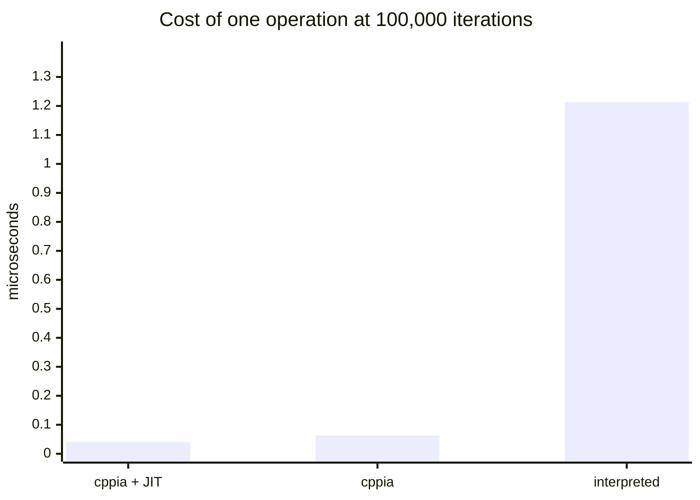
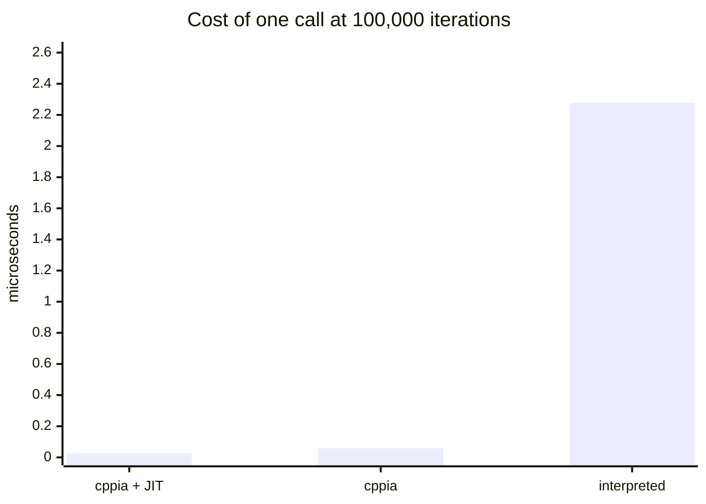

# Benchmarking the three execution modes

Measurements for [`modes.md`](modes.md), which is where what they mean is written up. This page is
the method and the evidence.

Same rules as the cross-library suite in [`benchmarks.md`](benchmarks.md), deliberately, because a
reader moving between the two should not have to learn a second table format. Read them beside each
other but do not compare their numbers: same rules, same scale, different corpus shape, and the
reason is below.

## Contents

- [What was measured](#what-was-measured): [corpus shape](#the-corpus-is-class-shaped-and-cannot-be-shared-with-the-other-suite),
  [how a case is run](#how-a-case-is-run), [build settings](#build-settings-and-why-they-are-not-tuning-choices),
  [scale](#one-scale)
- [Results](#results)
- [What the value checking caught](#what-the-value-checking-caught)
- [Reproducing](#reproducing)
- [What was tested](#what-was-tested)
- [Caveats](#caveats)

## What was measured

Same rules as the cross-library suite in [`benchmarks.md`](benchmarks.md), deliberately, because the
two are read together. Parsing and building are separated from execution and untimed, so the numbers
are execution speed rather than setup. Every case ends in a value the harness knows, and a mode that
runs a case without doing the work is reported as `WRONG` rather than as infinitely fast. That check
matters more here than it does across libraries: a compiler that quietly folded a loop away would
otherwise post an unbeatable number.

### The corpus is class-shaped, and cannot be shared with the other suite

`xbench` compares against other hscript-family libraries, so its cases are loose expressions, which
is the only shape all of them accept. The compiler takes class declarations. A bare
`var i = 0; ... i;` has nowhere to go, so every case here is one class with a static `run`, and the
case body is that method:

```haxe
// `call1`, at 100,000 iterations, expected value "7"
package p;
class T {
	public static function run():Dynamic {
		var i:Int = 0; var s:Int = 0;
		while (i < 100000) { s = f1(7); i += 1; }
		return s;
	}
	static function f1(a:Int):Int { return a; }
}
```

The loop is written into the script rather than around it, so what is timed is a mode running a loop
rather than the host calling into it N times. Read this document beside the cross-library one, but do
not compare the two sets of numbers directly: same rules and same scale, different corpus shape.

### How a case is run

Each mode supplies the same two steps to the harness:

- **`prepare(src)`** builds whatever that mode needs and is **untimed**. Interpreting parses and
  builds an environment; compiling parses, emits bytecode and boots a module, which is far more work.
- **`exec(handle)`** calls the static and is **timed**.

Per case the harness then:

1. calls `prepare` once; if it throws or returns null the case is `refused` for that mode and nothing
   is timed
2. runs 5 reps. Each rep calls `prepare` **again**, then times `exec` alone. Re-preparing every rep
   keeps a mode that warms a cache on its first run on the same footing as one that does not
3. takes the **median** of the 5 timings
4. compares the returned value against the expected one, and records `ok` or `wrong`

The median rather than the fastest run: best-of-N answers "how fast can this go when nothing
interferes", which flatters whichever run got the quietest slice of the machine. The median answers
"what does this usually cost", which is what a host budgeting a frame needs.

Each case runs in its own process with a 300-second timeout. That was already required for the
cross-library suite; here it is also what makes the JIT mode measurable at all, since its switch is
process-wide.

Every run emits one machine-readable line:

```
R|<mode>|<case>|<tier>|<iterations>|<status>|<median ms>|<value>
```

`collate.py` reads those and divides: microseconds per iteration is `median ms x 1000 / iterations`.
Nothing in the tables is a raw timing, which is why they stay comparable across scales.

Getting ready is measured separately, and is the only place `prepare` is timed: one source of 80
small functions, 11,799 characters, median of 5, no execution.

### Build settings, and why they are not tuning choices

Neither is a tuning choice. cppia resolves the host's classes by name when a module loads, and dead
code elimination removes whatever nothing references statically, so a compiled script reaching for a
standard-library member finds a null field. `-dce no` is also what the cross-library suite is built
with, so both documents describe the same build. A probe over 83 commonly-scripted standard-library
members found 42 unreachable under `-dce std` against 3 under `-dce no`; the catalogue is in
[`embedding.md`](embedding.md#dead-code-elimination).

`-D scriptable` is a decision about the host binary rather than about any script: it makes the
host's own types reachable from bytecode, which is what a compiled script calls into. What that
costs in binary size is not measured here.

### One scale

The corpus runs at 100,000 iterations, and unlike the cross-library suite this one has not been
checked across scales. `SCALES="25000 100000 500000"` runs it at three, which is worth doing before
trusting any of these figures at a size far from this one. The compiled modes are fast enough here
that a fixed per-call cost would show up as scale sensitivity, and nothing has ruled that out.

## Results

<!-- BEGIN GENERATED: test/bench/mbench/collate.py -->

### Every case, microseconds per iteration at 100,000

**Lower is faster**, except the two `vs interpreted` rows in the summary, which are
speedups where a bigger multiple is better, and `break-even`, where a smaller count
means compiling repays sooner.

One row per case, and the only per-case table in this document. `kind` is which average the
row feeds: `op` and `call` are averaged separately because they differ by design rather than
by degree. `unwind` cases are in neither, being dominated by how each mode implements
`continue` and `throw`, and nor are `compound` ones, which do far more than one operation per
iteration and would describe themselves rather than the mode.

Every case compiled. Nothing in this corpus falls outside what the compiler emits, which is
a statement about the corpus as much as about the compiler, since it is built from the
constructs a hot script actually uses, not from the language's edges.

<details>
<summary><strong>39 cases, click to expand</strong></summary>

| case | kind | interpreted | cppia | cppia + JIT |
| --- | --- | --- | --- | --- |
| `noCall` | op | 0.604 | 0.014 | 0.004 |
| `loopPlain` | op | 0.456 | 0.010 | 0.004 |
| `postIncr` | op | 0.388 | 0.008 | 0.002 |
| `arith` | op | 0.839 | 0.020 | 0.005 |
| `locals` | op | 1.515 | 0.027 | 0.004 |
| `blocks` | op | 1.137 | 0.026 | 0.004 |
| `not` | op | 0.665 | 0.017 | 0.004 |
| `neg` | op | 0.672 | 0.015 | 0.004 |
| `index` | op | 0.953 | 0.046 | 0.005 |
| `indexSet` | op | 0.664 | 0.038 | 0.005 |
| `field` | op | 1.797 | 0.024 | 0.004 |
| `fieldSet` | op | 1.103 | 0.018 | 0.004 |
| `method` | op | 2.777 | 0.113 | 0.083 |
| `ternary` | op | 0.886 | 0.027 | 0.008 |
| `switch` | op | 1.069 | 0.029 | 0.010 |
| `strConcat` | op | 1.410 | 0.144 | 0.117 |
| `strInterp` | op | 1.691 | 0.153 | 0.123 |
| `arrayDecl` | op | 1.803 | 0.061 | 0.030 |
| `mapLiteral` | op | 2.876 | 0.197 | 0.151 |
| `forRange` | op | 0.295 | 0.080 | 0.064 |
| `forArray` | op | 0.302 | 0.094 | 0.080 |
| `anonField` | op | 1.344 | 0.173 | 0.134 |
| `hostMethod` | op | 1.607 | 0.097 | 0.081 |
| `hostStatic` | op | 3.241 | 0.194 | 0.159 |
| `arrayPush` | op | 1.549 | 0.092 | 0.069 |
| `boolLogic` | op | 0.960 | 0.024 | 0.005 |
| `modArith` | op | 0.906 | 0.026 | 0.014 |
| `stringSwitch` | op | 1.021 | 0.036 | 0.010 |
| `nullCoal` | op | 0.654 | 0.025 | 0.004 |
| `call0` | call | 1.314 | 0.037 | 0.007 |
| `call1` | call | 2.009 | 0.040 | 0.008 |
| `call3` | call | 3.232 | 0.051 | 0.009 |
| `callCap20` | call | 1.999 | 0.040 | 0.008 |
| `closureCall` | call | 2.019 | 0.058 | 0.036 |
| `classCall` | call | 3.088 | 0.125 | 0.084 |
| `loopCont` | unwind | 0.629 | 0.018 | 0.004 |
| `tryCatch` | unwind | 4.560 | 2.530 | 0.022 |
| `classNew` | compound | 7.992 | 0.082 | 0.025 |
| `arrayCompr` | compound | 0.306 | 0.151 | 0.126 |

</details>

### Summary, over the 39 cases every mode ran

| | interpreted | cppia | cppia + JIT |
| --- | --- | --- | --- |
| us per operation (29 cases), lower is faster | 1.213 | 0.063 | 0.041 |
| us per call (6 cases), lower is faster | 2.277 | 0.058 | 0.025 |
| operation, vs interpreted, higher is faster | 1.0x | 19.2x | 29.5x |
| call, vs interpreted, higher is faster | 1.0x | 39.0x | 90.2x |
| corpus total, ms, lower is faster | 6233 | 496 | 152 |

The total row is a sum over cases of very different cost, so it is not a speedup and should
not be quoted as one. The single largest case in each column takes 13% (`classNew`) of interpreted, 51% (`tryCatch`) of cppia, 10% (`hostStatic`) of cppia + JIT. The two
ratio rows above are the comparable figures.





### What getting ready costs, and when it is repaid

The only place preparing is timed. One source of 80 small functions, median of 5, no
execution: parsing and building an environment for the interpreter, and parsing, emitting
bytecode and booting a module for the other two.

Compiling is a cost paid once against a saving paid per iteration, so the break-even column
is the number that decides whether to do it at all. Below that many operations in the life of
a module, interpreting finishes first.

| | interpreted | cppia | cppia + JIT |
| --- | --- | --- | --- |
| prepare, ms, lower is faster | 1.125 | 9.753 | 10.239 |
| break-even, operations, lower repays sooner | n/a | 7,501 | 7,775 |

<!-- END GENERATED -->

## What the value checking caught

Worth recording, because it is the argument for checking values at all rather than only timing them.

The first run of this corpus reported `arrayCompr` as `WRONG (0)` in both compiled columns.
`[for (k in 0...5) k]` was compiling to `[0]`: the emitter treated a comprehension as an array
literal holding one element, and that element was the loop. It ran, it returned, and it returned the
wrong answer, the failure a benchmark that only timed things would have published as a very fast
result.

Fixed by lowering a comprehension to an accumulator before emitting it, and the fix turned up two
further defects in the interpreter, both found by comparing the two columns rather than by either one
on its own:

- an empty comprehension returned `[null]`, or threw, instead of `[]`
- an array literal annotated with a type that has no runtime identity, as in `var a:Dynamic = [9]`,
  was rejected outright, because the branch that looks for an empty map to build resolved the
  annotation and treated failure as an error

All three are fixed and the whole corpus now agrees across the three modes. Thirteen further
comprehension shapes (filtering, `if`/`else`, nesting, blocks, key-value iteration, empty, and null
elements) are checked by `MBench.exe <mode> __compr`, which prints them per mode so the compiled
columns can be read against the interpreted one.

Two more wrong-answer bugs were caught the same way later, both while widening
[`test/cpp/CppiaTest.hx`](../test/cpp/CppiaTest.hx) rather than by reasoning about the emitter: an abstract
whose value read back as zero, and a guard that could not see what its pattern had bound. In each
case one passing test had already made the feature look finished.

## Reproducing

The harness is in [`../test/bench/mbench`](../test/bench/mbench).

```sh
sh test/bench/mbench/run.sh
```

```sh
SCALES="25000 100000 500000" sh test/bench/mbench/run.sh
```

Scales must be multiples of 1000, which is the array length `forArray` walks.

`collate.py` writes the whole of the Results section above. Paste its output between the two
`GENERATED` markers rather than editing the tables by hand: a re-run replaces all of it in one go and
there is nothing to keep in sync.

[`modes.md`](modes.md) quotes figures from here in prose, so a re-run that moves them wants a read
through that page too. It is written by hand on purpose, because what a number means is not something a
collator can generate.

## What was tested

Haxe 4.3.7, hxcpp 4.3.2, `-D scriptable -D hxscript_cppia -dce no`, Windows, single machine, one
sitting, 24-thread build. The library is the working tree.

| part | |
| --- | --- |
| CPU | AMD Ryzen 9 3900X, 12 cores / 24 threads |
| RAM | 32GB DDR4-3200 CL14 |
| storage | WD Black SN7100 2TB NVMe |

The same machine as the [cross-library comparison](benchmarks.md). Every figure is single-threaded:
the thread count built the binary, it did not run the corpus.

## Caveats

**Read the ratios, not the numbers.** Absolute microseconds drift with machine state by well over
10%. Rebuild and re-run everything in one sitting before comparing anything, and never merge a re-run
of one mode into a table measured in another sitting.

**A micro-benchmark is not an application.** These cases isolate single operations on purpose, so
they overstate the difference between modes relative to a real script that also spends its time in
the host's own code. A script that mostly calls into the host will move far less than these numbers
suggest, because the part being sped up is not where its time goes. Use them to understand *where*
the modes differ, then measure your own workload.

**Every case in this corpus compiled**, so it says nothing about where the compiler's limits are.
It is built from what a hot script does, not from the language's edges; abstracts, rest arguments and
destructuring patterns are not exercised here and are not all emitted. A corpus that probed those
would report a different and also useful thing.

